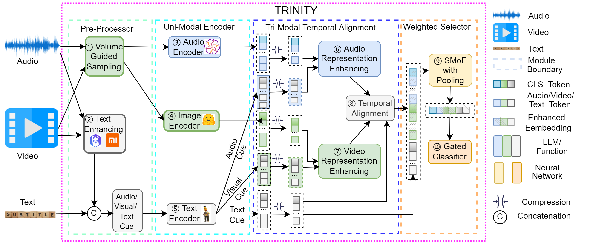

<div align="center">

# Tri-Modal Temporal-Alignment-based Multi-Modal Classification



The architecture of TRINITY. From left to right, TRINITY comprises four modules: pre-processor, uni-modal encoder, tri-modal temporal alignment, and weighted selector. TRINITY’s pre-processing has two functions: 1 volume guided sampling and 2 MLLM-based text enhancing. Our uni-modal encoder has three functions for audio, image, and text encoding, 345 respectively. The alignment block contains three functions. Two functions enhance the representation of audio and video (6 and 7), and a temporal alignment function 8 integrates all embeddings. In the weighted selector block, we leverage an SMoE as the model selector, which controls the size of embedding by pooling (9), and use a gated classifier to make the final decision (10).

</div>

## Github anonymous url: https://anonymous.4open.science/r/Trinity-27F4


## Table of Contents

- [Introduction](#introduction)
- [Installation](#installation)
- [Download Model](#download-model)
- [Download Datasets](#download-datasets)
- [Training](#training)
- [Testing](#testing)
- [Citation](#Citation)


## Introduction

Video analysis involves multi-modal classification (MC) problems, such as Audio-Visual Event Detection (AVE), Multi-modal Sentiment Analysis (MSA), and Audio-Visual Learning (AVL) for action recognition. Existing MC methods mainly focus on cue integration for AVL, temporal refinement for AVE, and representation learning for MSA. However, none of the previous studies have explored tri-modal temporal alignment, primarily because textual cues lack explicit temporal information, making it difficult to align them with audio and visual streams. To address this limitation, we propose TRINITY (Tri-modal tempoRal-alIgnmeNt-based multI-modal classificaTion), a unified framework for multi-modal classification. TRINITY leverages multi-modal large language models (MLLMs) to generate temporal-change-enriched textual cues that can be temporally aligned with audio and visual modalities, as well as audio-visual-related cues provided by MLLMs. To overcome the high computational cost of cross-attention, which restricts the number of tokens in basic fusion strategies, TRINITY introduces an efficient volume-guided sampling algorithm and a novel local Q-Former compression module to obtain compact yet informative representations. Based on these representations, a tri-modal temporal alignment module is designed to learn task-specific, semantically consistent embeddings across text, audio, and vision. Finally, TRINITY employs mixture-of-experts, gating, and pooling mechanisms to dynamically select and weight modality contributions.


## Installation  
To install the necessary dependencies for the Trinity-main-1948 project, you can use the following command:

```bash
conda create -n Trinity python=3.10.14
conda activate Trinity
pip install -r requirements.txt
```
**Note:** This project uses PyTorch 2.2.0 with CUDA 11.8 support (`torch==2.2.0+cu118`). Make sure your system has compatible CUDA drivers installed.


## Download Model
To download the `google-bert/bert-base-uncased` model from Hugging Face:

```bash
huggingface-cli download google-bert/bert-base-uncased --local-dir ./pretrained_model
```

## Download Datasets
MOSEI original data: See https://github.com/thuiar/MMSA

UCF51 original data: see https://github.com/GeWu-Lab/cross-modal-distillation

KS original data: see https://github.com/MengShen0709/bmmal

our prepared data and checkpoint download link: https://drive.google.com/drive/folders/1XLJaWM2ftpK_xCucExRS6Xy4N4GKyJdd?usp=drive_link

## Training
To run the training script:
```bash
python train_Action_cls.py --token_len 50 --device 0 --epochs 30 --batch_size 64 --vision_feats resnet2plus1D --audio_feats librosa --datasetName AVE --model_name Trinity --dataPath ./datasets/AVE_rms_k16_last.pkl --note Trinity_AVE
```
note: The results will be saved in the `./best_'dataset_cls'.txt` file.

## Testing

To run the testing script:
```bash
python test_Action_cls.py  --token_len 50 --device 0 --batch_size 64 --vision_feats resnet2plus1D --audio_feats librosa --model_name Trinity
```


## Citation  
If you find our work useful for your research, please cite our paper:  
title = {Tri-Modal Temporal-Alignment-based Multi-Modal Classification},
